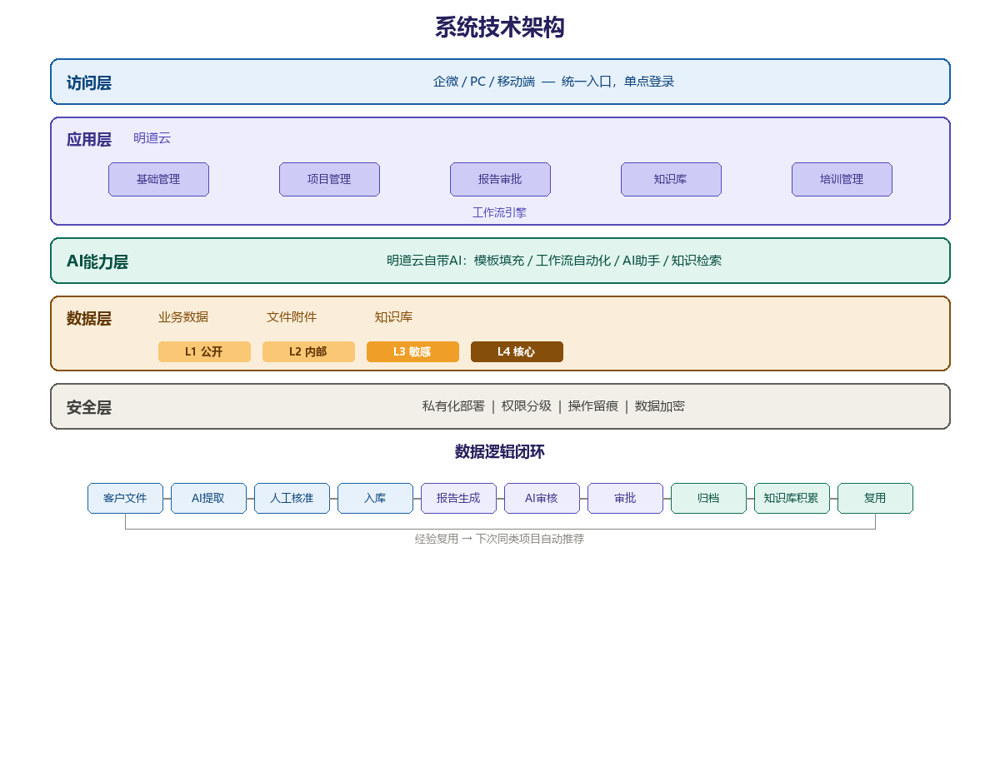

# 天遂税务师事务所数字化建设方案

> 版本：v3（大白话版）
> 日期：2026年7月

---

## 一、你们的现状

天遂20多个人，绝大部分是做项目的专业人员，管理很精干——老板加2个副总，1个人帮着跑市场，1个人帮着管行政。

业务不用多说，你们在行：鉴证、税务报告、咨询、筹划，客户都是上市公司、国央企、军工企业，靠的是口碑，政府朋友和老朋友介绍。

但沟通下来，有几个问题大家都感受到了：

**第一，新客户不好找。** 你们的专业能力很强，但外面的人看不到。老板想推广，又觉得税务师事务所不适合做自媒体。其实不是做自媒体——是把你们的专业经验变成文章、分析、解读，让潜在客户能感受到你们的专业水平。

**第二，做完一个项目，经验就散了。** 每个项目做下来积累的经验、踩过的坑、找到的解决办法，都在做项目的人脑子里。下次遇到类似的项目，还是从头来。老员工走了，经验也带走了。

**第三，老板看不到项目进度。** 现在靠微信群沟通，哪个项目到哪一步了、卡在哪里了、谁在跟进，老板得一个一个问。

**第四，重复活太多。** 报告的格式、底稿的整理、数据的核对——这些活专业人员能做，但不该花太多时间做。他们应该把时间花在专业判断上。

**第五，新人没人带。** 没有培养体系，新人来了靠师傅带，师傅忙起来就顾不上。新人成长慢，团队扩张也受限。

**一句话总结：你们的专业能力很强，但这些能力没有被积累下来、没有变成团队共用的东西。**

---

## 二、建设理念

跟贵所沟通中，我们达成了几个共识：

**第一，AI确实能帮忙，但不能跑太快。** 现阶段AI在文字生成、知识检索、数据分析方面已经能帮上忙，但在专业判断、复杂推理方面还不能替代人。所以我们提的是"AI数字化"——用AI辅助人，不是替代人。系统做初稿、做检查提示，最终判断和签字还是注册税务师负责。

**第二，实事求是，不画大饼。** 先从最痛的问题开始解决，让团队用起来、尝到甜头，再逐步扩展。

**第三，现在做的事，也是在为未来打基础。** AI能力会越来越强，现在虽然不能所有事都交给AI，但有两件事必须现在开始做：数据准备（底稿数字化、知识库建设）和AI习惯准备（从简单场景开始用，逐步习惯人机协作）。

---

## 三、我们要做什么

帮你们建一套系统，让专业经验从"个人的"变成"团队的"，从"做完就散"变成"越做越厚"。

具体来说，做六件事：

### 1. 建一个税务知识库，谁都能查、谁都能问

把你们脑子里的经验、散在各人电脑里的资料，整理成一个知识库。按行业、按税种、按业务类型分类。

新人遇到问题不用等师傅有空，直接问系统："制造业企业研发费用加计扣除有哪些注意事项？"系统从你们的知识库里找答案，还关联类似的历史案例。

税法每次更新，系统自动抓取新政策，帮你们解读要点，标注对哪些客户有影响。

**一句话：让你们的专业经验从"在脑子里"变成"在系统里"，谁都能用。**

### 2. 客户文件自动提取数据，报告起草快一倍

现在写一份鉴证报告，从拿到客户文件到成稿可能要好几天。系统帮你们把这个流程串起来：

**第一步——AI提取数据**：客户提交大量文件（财务报表、凭证、合同、发票等），AI自动识别文件类型，提取关键数据（收入、成本、费用、资产等），结构化整理好。

**第二步——人工核准**：AI提取的数据，专业人员核对一遍，确认没问题才入库。AI辅助提取，人工把关质量。

**第三步——生成报告初稿**：核准后的数据加上模板，自动生成报告初稿，专业人员在此基础上改。

**第四步——AI审核岗**：报告提交审批前，AI先过一遍，标注需要关注的点。副总审核时不用从头到尾逐行看，AI已经帮你标了重点。原有三级审核流程不变，只是在前面加了一个AI助手。

**重要：系统只做数据提取、初稿生成和检查提示，最终判断和签字还是注册税务师负责。**

### 3. 项目进度一目了然，做完就存档

建一个项目协作平台，替代微信群。每个项目的状态、负责人、关键节点、文件，一目了然。老板打开手机就能看到所有项目进展。

更关键的是：项目做完后，系统帮你们把关键经验、注意事项提取出来，自动存到知识库里。下次做类似的项目，系统直接推荐"上次做这个行业的客户，你们遇到过这些问题"。

### 4. 把纸质底稿变成电子的

你们现在底稿是纸质和电子混着管，找起来不方便。系统帮你们把纸质底稿扫描识别成电子文档，按项目、客户、年度分类存储，搜得到、查得到、管得住权限。

这件事在项目周期内先把框架搭好、规范定好，历史档案慢慢扫。

### 5. 帮你们产出专业内容

不是让你们做自媒体。是让你们的专业能力被外面的人看到。

你们做项目积累的经验、对行业税务的理解、对新政策的解读——这些内容，系统帮你们起草初稿，你们改改就能用。客户拜访时带一篇行业分析，行业活动时讲一个实务案例，朋友圈分享一篇政策解读。

客户介绍客户的时候，有专业内容做背书，比光说"这个人很专业"有说服力得多。

### 6. 新人不用干等师傅

系统里有历史真实案例，新人可以问"这种情况下该怎么处理"，系统基于你们的案例库回答。系统还能出题让新人练——模拟鉴证场景，让新人自己做判断，做完再看标准答案和注意事项。

新人成长快了，老师傅的精力也不用花在"手把手教"上了。

---

## 四、技术架构

系统采用私有化部署，所有数据完全在你们自己的服务器上，不经过任何外部网络。

**数据逻辑闭环**：客户文件→AI提取→人工核准→入库→报告生成→AI审核→审批→项目归档→知识库积累→下次复用。数据在系统里转一圈，越用越厚。

**数据分级管理**：公开资料、内部资料、客户敏感资料、核心财务数据分四级管理，不同级别不同权限，确保大客户数据安全。

---

## 五、怎么做

所有功能在2-3个月内完成：

| 时间 | 做什么 |
|------|--------|
| 第1周 | 确认需求，客户提交资料 |
| 第2周 | 环境部署，服务器+企微接入 |
| 第3-4周 | 基础模块+人事/行政/财务/客户管理 |
| 第5-6周 | 项目管理+AI周报 |
| 第7-8周 | 知识库+企微AI客服+政策抓取 |
| 第9-10周 | 报告模板+客户文件数据提取+AI审核岗 |
| 第11周 | 培训模块 |
| 第12周 | 全员培训，试运行，上线 |

---

## 六、功能与费用

### 功能模块

| 模块 | 功能 | AI特色 | 常规人天 | AI人天 | 原价(元) | 优惠价(元) |
|------|------|--------|---------|--------|---------|---------|
| 基础模块 | 组织架构/花名册/权限 | — | 8 | — | 16,000 | 12,800 |
| 人事管理 | 证照/合同/考勤/请假/工资 | — | 8 | — | 16,000 | 12,800 |
| 行政管理 | 行政审批流 | — | 3 | — | 6,000 | 4,800 |
| 财务管理 | 报销管理 | — | 2 | — | 4,000 | 3,200 |
| 客户管理 | 客户档案/关联项目 | — | 2 | — | 4,000 | 3,200 |
| 项目管理 | 立项/任务/进度/资料 | **AI周报** | 8 | 4 | 28,000 | 22,400 |
| 报告审批 | 数据提取/核准/报告/审批 | **AI审核岗** | 4 | 4 | 20,000 | 16,000 |
| 知识库 | 知识库/问答/政策抓取 | **Agent数字员工** | 3 | 4 | 18,000 | 14,400 |
| 新员工培训 | 课程/题库/陪练 | AI陪练 | 1 | 1 | 5,000 | 4,000 |
| 基础设施 | 部署/企微/培训 | — | 3 | — | 6,000 | 4,800 |
| **合计** | | | **42** | **13** | **123,000** | **98,400** |

> 常规配置2,000元/天，AI能力集成3,000元/天。原价123,000元，**优惠价8折 = 98,400元**。

### 两个AI特色功能

**AI审核岗**：不改变原有三级审核，在前面加一个AI预审环节——AI先过一遍标风险点，审核人员不用从头逐行看。

**Agent数字员工**：企微AI客服，有岗位有职责——客户问政策、内部人员问业务，7×24小时在线。

### 费用构成

| 费用项 | 金额 | 说明 |
|--------|------|------|
| **1. 开发费** | 原价 **12.3万** | 常规42天×2,000+AI 13天×3,000。**优惠价8折，折后 9.84万**。可分期。 |
| **2. 硬件费** | 按需 | 云服务器+NAS。客户可自购，我方提供规格建议。 |
| **3. 年度订阅费** | 约6,000元/年起 | 明道云License年订阅。 |
| **4. 第三方费用** | 按使用量 | AI调用费、短信费、域名费等，按实际产生，不加价。 |

---

## 七、保障

| 事项 | 承诺 |
|------|------|
| 数据安全 | 私有化部署，数据分级管理，所有数据在你们自己的服务器上 |
| 专业边界 | AI做初稿和提示，签字判断由注册税务师负责 |
| 上线保障 | 含培训、使用手册、试运行支持 |
| 透明定价 | 开发费10万可分期，其他费用按需/按量，清楚明白 |

---

## 八、接下来怎么走

1. 你看完这份方案，觉得方向对，我们细聊实施安排
2. 确认需求清单，签订项目合同
3. 开始实施，2-3个月完成全部功能
4. 上线运行，项目完成后提供持续服务（按需签订）

> 项目完成后，在使用中会发现新的需求——有些可以AI解决，有些可以流程优化解决；底稿需要持续数字化，知识库需要持续充实。这不是一锤子买卖，是持续进化的过程。
